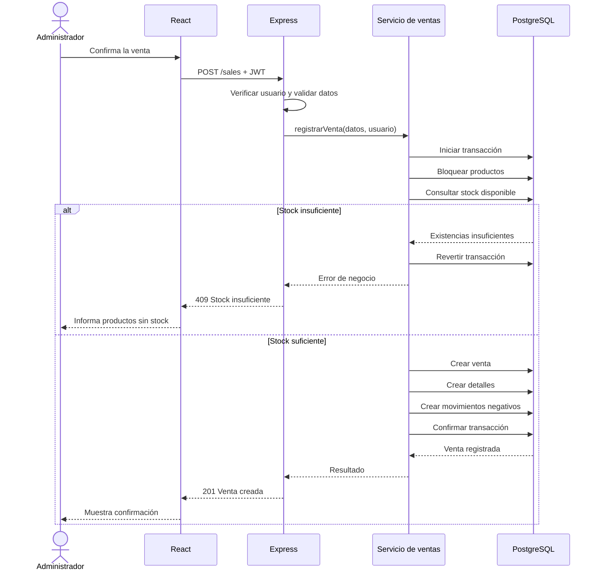

# Diagramas de secuencias críticas

## Registrar Venta

```mermaid
sequenceDiagram
    actor A as Administrador
    participant R as React
    participant E as Express
    participant S as Servicio de ventas
    participant DB as PostgreSQL

    A->>R: Confirma la venta
    R->>E: POST /sales + JWT
    E->>E: Verificar usuario y validar datos
    E->>S: registrarVenta(datos, usuario)

    S->>DB: Iniciar transacción
    S->>DB: Bloquear productos
    S->>DB: Consultar stock disponible

    alt Stock insuficiente
        DB-->>S: Existencias insuficientes
        S->>DB: Revertir transacción
        S-->>E: Error de negocio
        E-->>R: 409 Stock insuficiente
        R-->>A: Informa productos sin stock
    else Stock suficiente
        S->>DB: Crear venta
        S->>DB: Crear detalles
        S->>DB: Crear movimientos negativos
        S->>DB: Confirmar transacción
        DB-->>S: Venta registrada
        S-->>E: Resultado
        E-->>R: 201 Venta creada
        R-->>A: Muestra confirmación
    end
```