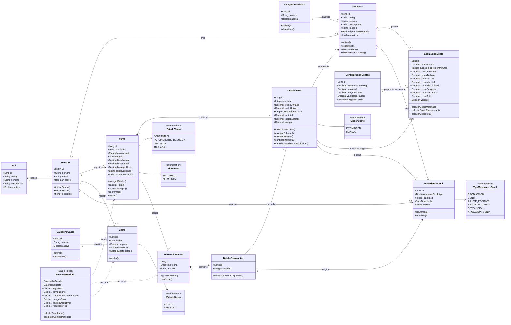

## Interpretación principal

- Representa conceptos y comportamiento del negocio, no tablas.
- Cada usuario tiene un único rol. Inicialmente todos tendrán ADMINISTRADOR.
- Un producto representa un tipo de artículo, no una unidad física.
- La producción no necesita clase propia: es un movimiento positivo de stock.
- El stock se obtiene sumando movimientos.
- Una venta siempre contiene uno o más detalles.
- Cada venta tiene un tipo obligatorio, MAYORISTA o MINORISTA, común a todos sus detalles y conservado históricamente.
- El precio efectivo y el costo se registran individualmente en cada detalle de venta.
- El detalle conserva el costo y precio históricos.
- Una devolución siempre pertenece a una venta y referencia sus detalles.
- La anulación revierte la venta completa; una devolución puede ser parcial.
- ResumenPeriodo es un resultado calculado y no necesariamente una entidad persistida; permite desglosar ventas por tipo.
- El método para calcular precios sugeridos continúa pendiente, por lo que no se representa como regla definitiva.

