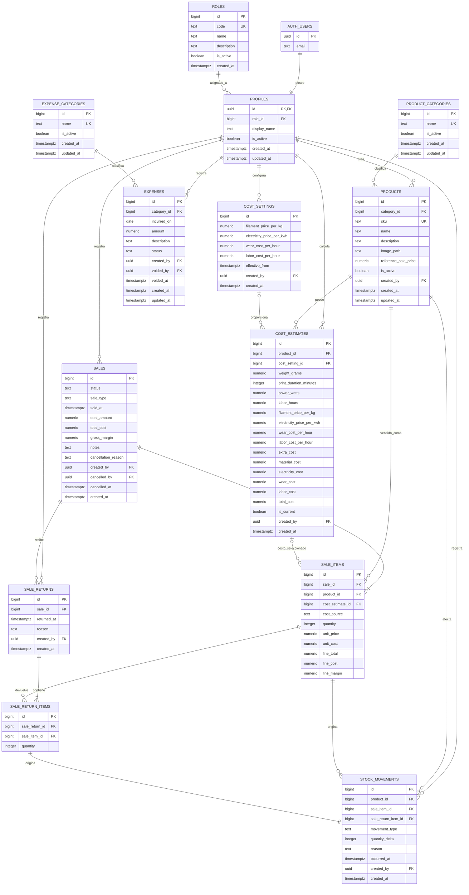

## Diagrama Entidad Relación del MVP

Consideraciones del DER:

- `auth.users` pertenece a Supabase y gestiona credenciales y sesiones.
- `profiles` contiene los datos propios de la aplicación.
- `profiles.role_id` permite incorporar otro rol sin alterar la tabla de usuarios.
- `roles` tendrá inicialmente una sola fila: ADMINISTRADOR.
- El registro público debería estar deshabilitado durante el MVP.
- El usuario no puede modificar su propio `role_id`.
- Se utilizan `bigint identity` para entidades y UUID únicamente para usuarios de Supabase.
- Los importes deben usar `numeric`, nunca `float`.
- Fechas con hora deben usar `timestamptz`.
- Productos, categorías y roles se desactivan; no se eliminan si tienen relaciones históricas.
- Las estimaciones son históricas. Solo una debería estar marcada como vigente por producto.
- `sales.sale_type` es obligatorio en la cabecera y admite únicamente `MAYORISTA` o `MINORISTA`; no tiene valor predeterminado. Se conserva al anular o devolver la venta.
- `sale_items.unit_price` conserva el precio efectivo por unidad; puede diferir de `products.reference_sale_price`.
- `sale_items.unit_cost` siempre conserva el costo aplicado.
- `cost_estimate_id` es opcional porque el costo puede ser manual.
- No existe una tabla de stock editable.
- El stock actual se calcula sumando `quantity_delta`.
- La venta, sus detalles y movimientos deben guardarse en una única transacción.
- La devolución crea movimientos positivos.
- La anulación conserva la venta y crea movimientos compensatorios.
- Las operaciones históricas no se actualizan ni eliminan directamente.
- Todas las claves foráneas deben tener índices.
- Las tablas deben habilitar RLS, incluso si inicialmente todos los usuarios poseen el mismo rol.

Restricciones:

- `roles.code` único y en mayúsculas.
- `profiles.role_id` obligatorio.
- `products.reference_sale_price >= 0`.
- `cost_estimates.weight_grams >= 0`.
- `cost_estimates.print_duration_minutes >= 0`.
- `cost_estimates.power_watts >= 0`.
- `cost_estimates.extra_cost >= 0`.
- `cost_estimates.total_cost >= 0`.
- `sales.sale_type NOT NULL` con `CHECK (sale_type IN ('MAYORISTA', 'MINORISTA'))`.
- `sale_items.quantity > 0`.
- `sale_items.unit_price >= 0`.
- `sale_items.unit_cost >= 0`.
- `sale_return_items.quantity > 0`.
- `stock_movements.quantity_delta != 0`.
- `expenses.amount > 0`.

